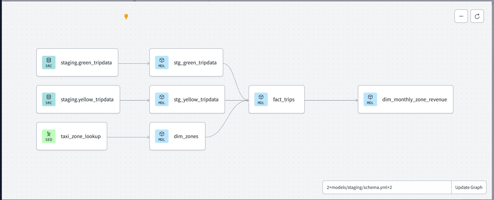

# 🛠️ Data Pipeline and Orchestration using GCP, Kestra, DBT Cloud & Looker

This project demonstrates a robust data pipeline architecture built with modern tools: data is extracted and stored in Google Cloud Storage, orchestrated with Kestra, transformed in BigQuery via DBT Cloud, and visualized using Looker Studio.

---

### 🚀 Technologies Used

- **Kestra**: An open-source orchestration tool used to automate data workflows. In this project, Kestra schedules and manages the entire ETL process.
- **Google Cloud Storage (GCS)**: Used as a landing zone for scraped data from external sources.
- **BigQuery**: Serves as the central data warehouse, used for querying and analytics at scale.
- **DBT Cloud**: Used for transforming raw data into clean, analytics-ready datasets within BigQuery using SQL and Jinja.
- **Looker Studio**: A lightweight dashboarding tool to build interactive reports and visualizations from BigQuery.

---

### 🧰 Languages & Tools

- **Python** – Used for data scraping and loading scripts.
- **SQL** – Used in DBT models to transform data.
- **Kestra YAML** – For defining and scheduling workflows.
- **Terraform** *(optional)* – For infrastructure automation if required.

---

### 📦 Datasets

Data is extracted from the [NYC Taxi & Limousine Commission Trip Record Dataset](https://www.nyc.gov/site/tlc/about/tlc-trip-record-data.page), which contains detailed trip information from yellow and green taxis in NYC.

---

### 🏁 Getting Started

1. **Set Up GCP**
   - Create a GCP project, enable BigQuery and Cloud Storage.
   - Create a Cloud Storage bucket for raw data storage.
   - Create a BigQuery dataset and tables.

2. **Deploy Kestra**
   - Install Kestra via Docker or host on a VM.
   - Add your workflows in the `flows/` directory.
   - Update credentials and parameters to match your GCP project.
   - Run or schedule the flows using the Kestra UI or API.

3. **Configure DBT Cloud**
   - Connect DBT Cloud to your BigQuery project.
   - Use the `/dbt/` folder (or link to your hosted repo) for DBT models.
   - Set up and trigger jobs manually or on schedule using DBT Cloud UI.

4. **Visualization with Looker Studio**
   - Connect your BigQuery tables to Looker Studio.
   - Use filters, date ranges, and charts to build insights dashboards.
   - Example Dashboard: [Looker Report](https://lookerstudio.google.com/reporting/b5bae0e4-6b63-4e86-8b60-0a4374d01e45)

---

### 🔄 Pipeline Flow Summary

`Kestra Workflow` → `Python scraper` → data saved to `GCS` → `BigQuery Load Job` → `DBT Cloud transformation` → `Looker Dashboard`

---

### 📁 Project Structure

project-root/
│
├── flows/                    # Kestra workflow definitions
│   └── nyc_taxi_etl.yml
│
├── dbt/                      # DBT models and configuration
│   └── models/
│
├── scripts/                  # Python scripts for scraping/loading
│   └── scraper.py
│
├── readme_images/            # Screenshots used in this README
│   └── airflow.png
│
└── README.md

---

### 🧭 DBT Lineage Example

---

### 📊 Dashboard Sample

- [🚖 NYC Taxi Trip Dashboard – Looker Studio](https://lookerstudio.google.com/reporting/b5bae0e4-6b63-4e86-8b60-0a4374d01e45)

---

### 📌 Additional Notes

- Credentials and secrets should be managed using GCP Secret Manager or Kestra’s environment settings.
- You can extend this pipeline by integrating Data Quality checks or anomaly detection using Python or dbt tests.

